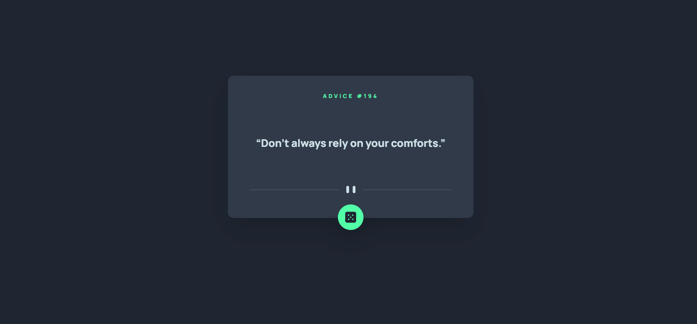
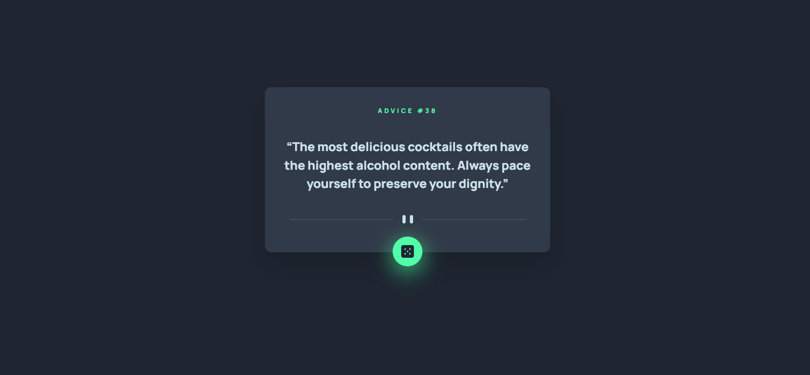

# Frontend Mentor - Advice generator app solution

This is a solution to the [Advice generator app challenge on Frontend Mentor](https://www.frontendmentor.io/challenges/advice-generator-app-QdUG-13db). Frontend Mentor challenges help you improve your coding skills by building realistic projects.

## Table of contents

- [Overview](#overview)
  - [The challenge](#the-challenge)
  - [Screenshots](#screenshot)
- [My process](#my-process)
  - [Built with](#built-with)
  - [What I learned](#what-i-learned)
  - [Continued development](#continued-development)
  - [Useful resources](#useful-resources)
- [Author](#author)

**Note: Delete this note and update the table of contents based on what sections you keep.**

## Overview

### The challenge

Users should be able to:

- View the optimal layout for the app depending on their device's screen size
- See hover states for all interactive elements on the page
- Generate a new piece of advice by clicking the dice icon

### Screenshots

- Mobile Design <br />


- Desktop Design <br />


- Interactive Elements <br />


## My process

### Built with

- Flexbox
- Mobile-first workflow
- [React](https://reactjs.org/) - JS library
- [TailwindCSS](https://tailwindcss.com/) - For styles

### What I learned

- _Fetching APIs and JS Async/Await_. In this project, I was able to build a simple web app that uses an API to generate a random advice. My major learning in this particular project are: (1) I learned how to fetch APIs, and (2) I was also able to use the async/await of JavaScript.

Code snippet:

```tsx
const fetchingApi = async () => {
  const apiRequest = await fetch('https://api.adviceslip.com/advice');
  const apiResponse = await apiRequest.json();
        
  setItems(apiResponse);
}
```

### Continued development

The concept(s) that I'm still not completely comfortable with:

- React Hooks
- JS Async/Await

### Useful resources

- [Fetching API](https://youtu.be/cuEtnrL9-H0) - This is the video tutorial that I used to learn how to fetch APIs in JavaScript.
- [JavaScript Async/Await](https://youtu.be/V_Kr9OSfDeU) - This short YT Tutorial gave me just enough information about JavaScript Async/Await to grasp everything I needed to start working with APIs and exploring them on my own.

## Author
- LinkedIn - [Kian Candelario](https://www.linkedin.com/in/kian-candelario-11440a240/)
- Frontend Mentor - [@KianCandelario](https://www.frontendmentor.io/profile/KianCandelario)