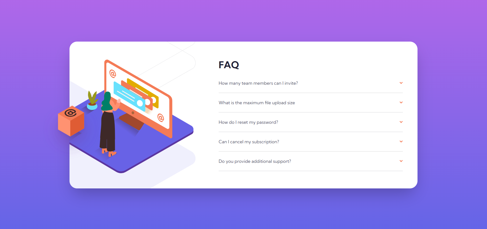
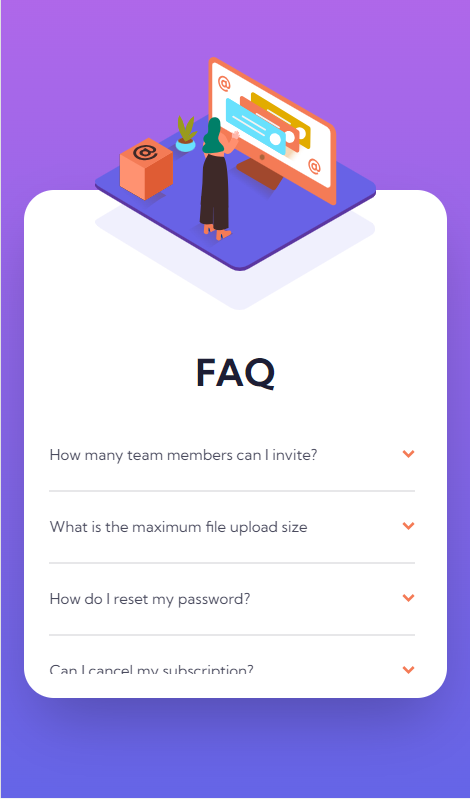
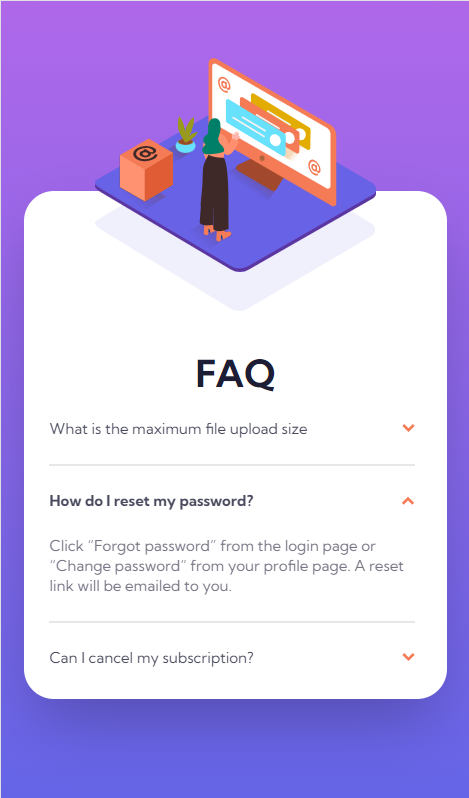

# Frontend Mentor - FAQ accordion card solution

This is a solution to the [FAQ accordion card challenge on Frontend Mentor](https://www.frontendmentor.io/challenges/faq-accordion-card-XlyjD0Oam). Frontend Mentor challenges help you improve your coding skills by building realistic projects.

## Table of contents

- [Overview](#overview)
  - [The challenge](#the-challenge)
  - [Screenshot](#screenshot)
- [My process](#my-process)
  - [Built with](#built-with)
  - [What I learned](#what-i-learned)
  - [Continued development](#continued-development)
  - [Useful resources](#useful-resources)
- [Author](#author)

## Overview

### The challenge

Users should be able to:

- View the optimal layout for the component depending on their device's screen size
- See hover states for all interactive elements on the page
- Hide/Show the answer to a question when the question is clicked

### Screenshots

- Desktop Design <br />
  

- Mobile Design <br />
  

- Interactive Elements <br />
  
  
  

## My process

### Built with

- Flexbox
- Grid
- Mobile-first workflow
- [React](https://reactjs.org/) - JS library
- [TailwindCSS](https://tailwindcss.com/) - For styles

### What I learned

- _useState hook and useEffect hook_. In this practice project, I was able to use these two React hooks. I gained first-hand experience of actually using them in a project instead of just watching them in a video tutorial. For that reason, I think I now understand their concept a bit better than before.

Code snippet:

```tsx
const [currWidth, setCurrWidth] = useState(window.innerWidth);

const resized = () => {
  setCurrWidth(window.innerWidth);
};

useEffect(() => {
  window.addEventListener("resize", resized);

  return () => {
    window.removeEventListener("resize", resized); // Cleanup
  };
}, []);
```

- _.map() JavaScript Array Method_. I learned how to use .map() method in a more complicated way than the last time I used it.

Code snippet:

```tsx
contents.map((content, index) => (
  <div key={content.id}>
    <div
      className={`flex justify-between items-center py-5 text-vdark-grayish-blue lg:pb-5 lg:py-0 lg:col-start-3 ${ index === i ? "border-b-0" : "border-b-2 border-light-grayish-blue lg:mb-5" } ${ index === contents.length - 1 && i === null ? "lg:mb-0" : "" /*Remove the margin bottom of the last child element */ }`}
      onClick={() => {
        clicked(index);
      }}
    >
      ...
  </div>
));
```

### Continued development

The concept(s) that I'm still not completely comfortable with:

- React Hooks
- .map() JavaScript Array Method

### Useful resources

- [JavaScript Array Methods](https://youtu.be/R8rmfD9Y5-c) - This is a brief but comprehensive YouTube video about the different JavaScript array methods. What I like about this is that even though it is a short video (10:05 minutes), it is divided into 8 different parts, but it teaches the gist—the essence—of the methods, which enabled me to ingest enough information to do it and explore it on my own—particularly the _.map()_ method.
- [W3Schools .map() JavaScript Array Method](https://www.w3schools.com/jsref/jsref_map.asp) - This website helped me understand the .map() method better. I particularly used it to figure out the different parameters of the .map() method.
- [Building Accordion using React](https://youtu.be/bGpZrr32ECw) - This YouTube video tutorial gave me the idea of how to build an accordion using React because, tbh, I didn't have a slight idea how I was going to do it when I was just starting (I tried various ways but they all failed). I learned in this particular video that one way of efficiently doing it is using the .map() array method.
- [React Hooks Video Tutorial](https://youtube.com/playlist?list=PLZlA0Gpn_vH8EtggFGERCwMY5u5hOjf-h) - This is the playlist of React Hooks Video Tutorials from Web Dev Simplified. This playlist helped me understand the gist of _useState and useEffect hooks_, which I used to create this project.

## Author

- Frontend Mentor - [@KianCandelario](https://www.frontendmentor.io/profile/KianCandelario)
- LinkedIn - [Kian Candelario](https://www.linkedin.com/in/kian-candelario-11440a240/)
