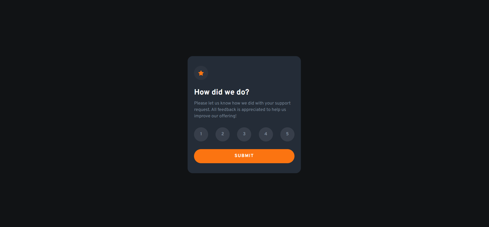
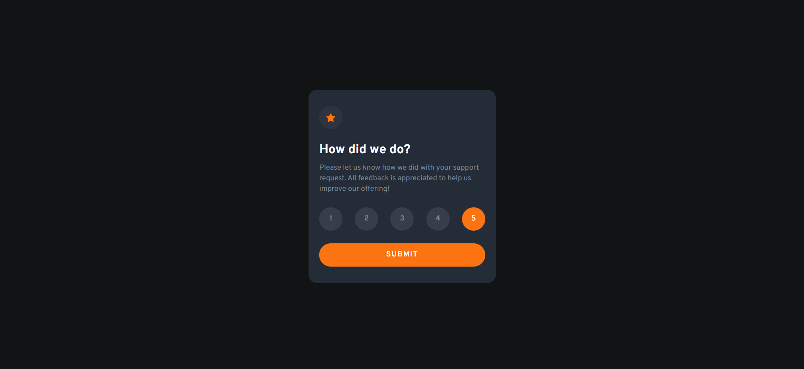

# Frontend Mentor - Interactive rating component solution

This is a solution to the [Interactive rating component challenge on Frontend Mentor](https://www.frontendmentor.io/challenges/interactive-rating-component-koxpeBUmI). Frontend Mentor challenges help you improve your coding skills by building realistic projects. 

## Table of contents

- [Overview](#overview)
  - [The challenge](#the-challenge)
  - [Screenshot](#screenshot)
- [My process](#my-process)
  - [Built with](#built-with)
  - [What I learned](#what-i-learned)
  - [Continued development](#continued-development)
  - [Useful resources](#useful-resources)
- [Author](#author)

## Overview

### The challenge

Users should be able to:

- View the optimal layout for the app depending on their device's screen size
- See hover states for all interactive elements on the page
- Select and submit a number rating
- See the "Thank you" card state after submitting a rating

### Screenshots

- Desktop <br />



- Mobile <br />


- Interactive Elements <br />




## My process

### Built with

- Flexbox
- Mobile-first workflow
- [React](https://reactjs.org/) - JS library
- [TailwindCSS](https://tailwindcss.com/) - For styles

### What I learned

The major learnings I had while working with this project are: (1) First, *ternary operators*. I learned how to use ternary operators to write a short but robust code. (2) Second, *useState hook*. I learned how to use one of the most used and important hooks in React. (3) Third, *conditional rendering*. I learned how to render a specific component depending on the outcome of the condition. (4) Finally, *passing props*. I learned how to pass props from one component to another.

Some of the code snippets:

```tsx
<button className='w-full py-3 bg-orange text-white text-sm rounded-full tracking-widest font-bold active:bg-white active:text-orange ease-in-out duration-300' onClick={activeIndex > 0 ? () => setSubmitted(true) : () => alert('Please select a number for rating')}>SUBMIT</button>
```

```tsx
{ submitted === false ?
  ...
  : <Submitted rating={activeIndex} />
}
```

```tsx
type Rating = {
    rating: number;
}

function Submitted(props: Rating) {
    return(
        <>
          ...
            <p>You selected {props.rating} out of 5</p>
          ...
        </>
    );
}
```

### Continued development

The concept(s) that I'm still not completely comfortable with:
- useState hook

### Useful resources

- [Conditional Rendering YT Tutorial](https://www.youtube.com/watch?v=4oCVDkb_EIs&t=296s) - This video helped me to understand the concept of conditional rendering in React. I'd recommend it to anyone who wants to use it but still learning the concept.
- [Passing Props in React using Typescript](https://dev.to/mconner89/passing-props-in-react-using-typescript-20lm) - This helped me understand how to use 'type' in Typescript when passing props in React.

## Author
- LinkedIn - [Kian Candelario](https://www.linkedin.com/in/kian-candelario-11440a240/)
- Frontend Mentor - [@KianCandelario](https://www.frontendmentor.io/profile/KianCandelario)