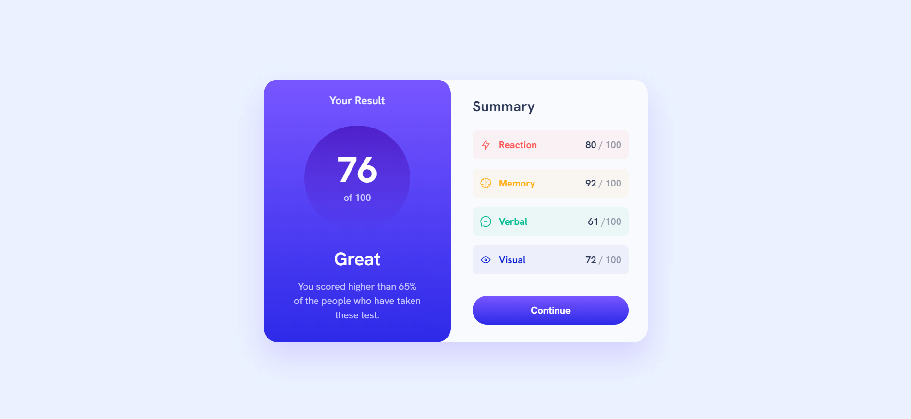
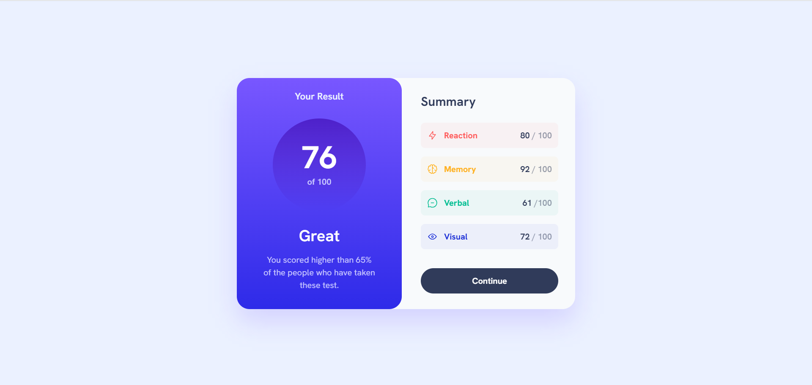
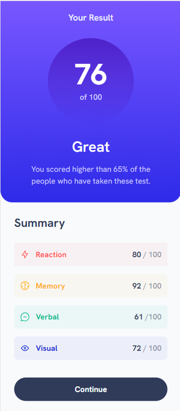

# Frontend Mentor - Results summary component solution

This is a solution to the [Results summary component challenge on Frontend Mentor](https://www.frontendmentor.io/challenges/results-summary-component-CE_K6s0maV). Frontend Mentor challenges help you improve your coding skills by building realistic projects. 

## Table of contents

- [Overview](#overview)
  - [The challenge](#the-challenge)
  - [Screenshot](#screenshot)
- [My process](#my-process)
  - [Built with](#built-with)
  - [What I learned](#what-i-learned)
  - [Useful resources](#useful-resources)
- [Author](#author)

## Overview

### The challenge

Users should be able to:

- View the optimal layout for the interface depending on their device's screen size.
- See hover and focus states for all interactive elements on the page.

### Screenshots







## My process

### Built with

- Flexbox
- Mobile-first workflow
- [React](https://react.dev/) - JS library
- [Tailwind CSS](https://styled-components.com/) - For styles

### What I learned

I have a solid understanding of CSS Fundamentals and website layouting using Flexbox. For that reason, adapting to React components and TailwindCSS is quite easy for me. However, the major learning I had while working on this project was handling the *responsiveness* of the website for different screen sizes. Fortunately, accomplishing this with TailwindCSS is very straightforward.

Some of the code snippets:

```tsx
function App() {
  return (
    <>
      <div className='w-screen h-screen flex justify-center items-center bg-pale-blue'>
        <div className='w-full h-full flex flex-col bg-slate-50 sm:flex sm:flex-row  sm:h-1/2 sm:w-4/5 sm:drop-shadow-2xl sm:rounded-3xl md:h-1/2 md:w-3/4 lg:w-3/5 lg:h-1/2 xl:w-1/2 xl:h-1/2 2xl:w-5/12 2xl:h-3/5'>
          <Result />
          <SummaryContainer />
        </div>
      </div>
    </>
  )
}
```
```tsx
function Circle() {
    return (
        <>
            <div className="w-40 h-40 sm:w-36 sm:h-36 md:w-40 md:h-40 2xl:w-44 2xl:h-44 bg-gradient-to-b from-violet-blue to-persian-blue rounded-full flex flex-col gap-1 justify-center items-center my-6">
                <div className="font-bold text-6xl sm:text-5xl md:text-6xl text-white">
                    <h1>76</h1>
                </div>
                <div className="text-light-lavender font-semibold">
                    <h3>of 100</h3>
                </div>
            </div>
        </>
    );
}
```

### Useful resources

- [React Documentation](https://react.dev/learn) - This helped me understand the importance of React components, the convenience it gives in code management and code reusability, and also how to properly tackle a project when using the React library. I really liked this and I will, for sure, use it going forward.
- [TailwindCSS Documentation](https://tailwindcss.com/) - This is where I learn TailwindCSS. The documentation is quite detailed, very efficient, easy to understand, and comprehensive.

## Author
- LinkedIn - [Kian Candelario](https://www.linkedin.com/in/kian-candelario-11440a240/)
- Frontend Mentor - [@KianCandelario](https://www.frontendmentor.io/profile/KianCandelario)